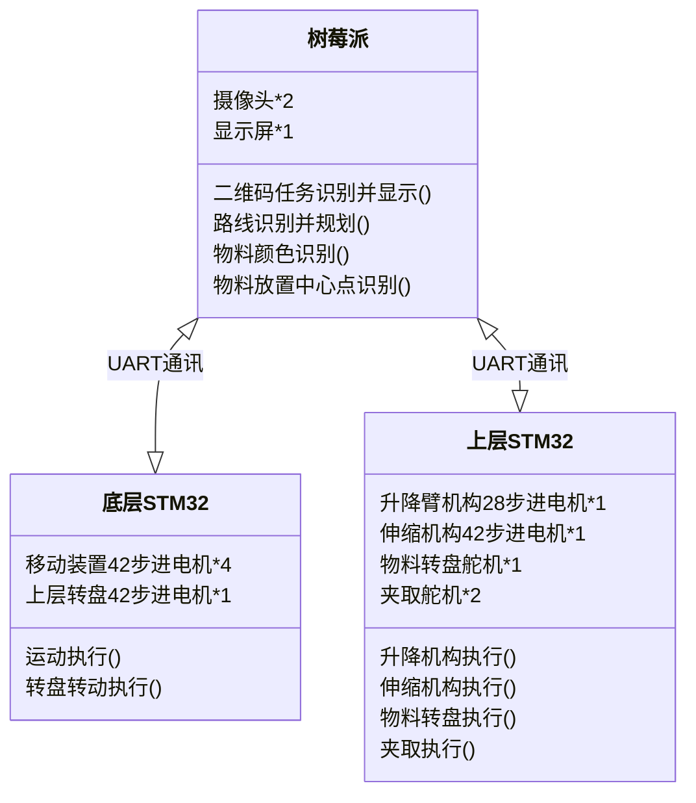
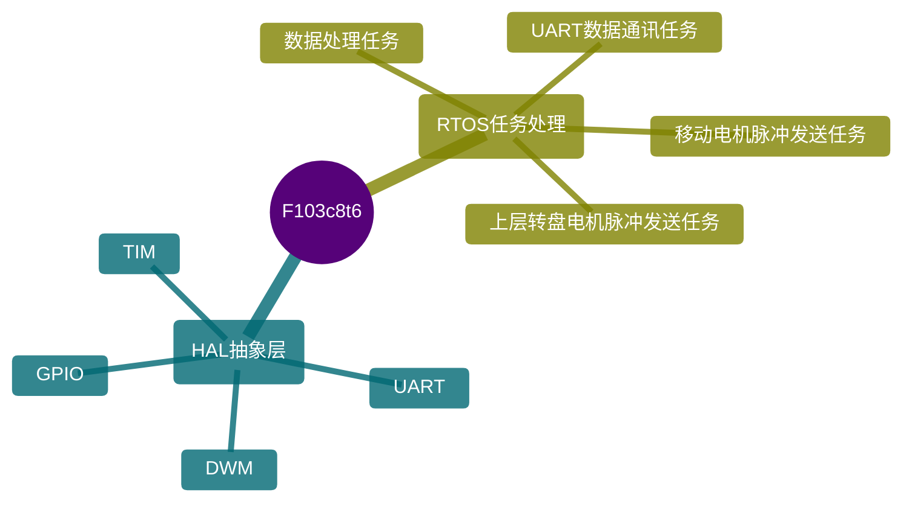
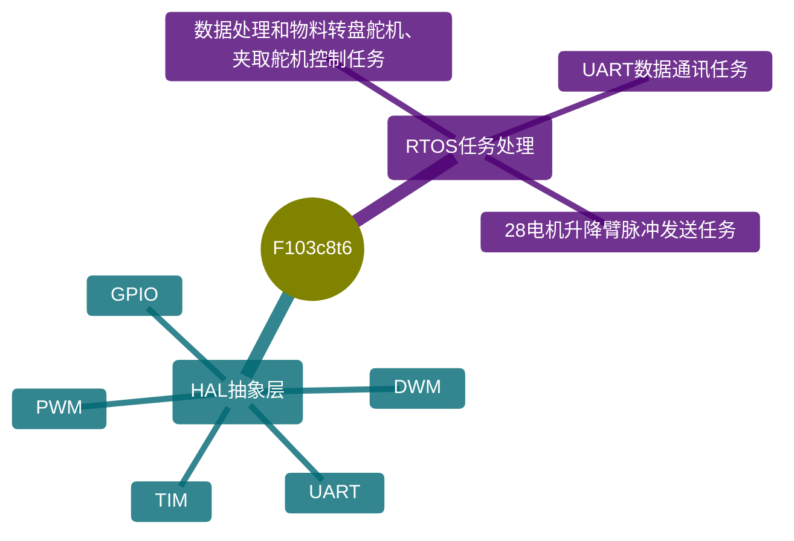

# 项目介绍
- 工创赛智能物流小车程序文件
    - Actuator-dev:机构控制模块
    - Move-dev:移动控制模块
    - Scipt-py:自动化模块生成脚本
- Actuator-dev
    - Core\BSP

- Move-dev
    - Core\BSP
        - 42-dev:步进电机驱动
        - Control:移动控制算法
        - DWT:定时器驱动
        - `BSP_conf.h`GPIO与常量信息配置
    - Core\Src
        - `freertos.c`任务实现
        - `main.c`功能模块初始化程序入口
- Scipt-py
    - AutoFile:自动化C模块生成
    - Template:储存模板文件
----------------------
# 开发环境

- 译构建软件:__STM32CubuMX__,__Clion__
- 编译链工具:__CMake__,__gcc-arm-none-eabi__,__`Pyhon3.12`__
- 主控芯片:__STM32F103C8T6__,__`RK3866`__
- 框架:__HAL__,__RTOS__,__`Open-cv`__
----------------------
# 基本框架

### `控制逻辑`

----------------------
### `底部STM32架构框架`

----------------------

### `上层STM32架构框架` 

----------------------
