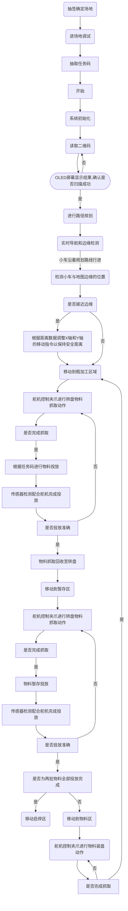

```mermaid
flowchart TD
    
    AC(抽签确定场地)-->AB 
    AB(进场地调试)-->AA
    AA[抽取任务码]--> A
    A[开始] -->J(系统初始化)
    J-->B(读取二维码)
    B-->B1([OLED屏幕显示结果,确认是否扫描成功])
    B1-->|否|B
    B1-->|是|K(进行路径规划)
   K-->L(实时导航和边缘检测)
   L--> |小车沿着规划路线行进|M(检测小车与地图边缘的位置)
    M --> N(是否接近边缘)
    N -->|是| O[根据距离数据调整X轴和Y轴的移动指令以保持安全距离]
    N -->|否| C
    O-->C(移动到粗加工区域)
    C-->D[舵机控制夹爪进行转盘物料抓取动作]
    D-->E[是否完成抓取]
    E-->|是|F[根据任务码进行物料投放]
    F-->G[传感器检测配合舵机完成投放]
    G-->H[是否投放准确]
    H-->|是|I[物料抓取回收至转盘]
    H-->|否|D
    I-->I1(移动到暂存区)
    I1-->P[舵机控制夹爪进行转盘物料抓取动作]
    -->Q[是否完成抓取]
    -->|是|R[物料暂存投放]
    -->S[传感器检测配合舵机完成投放]
    -->T[是否投放准确]
    T-->|是|U[是否为两批物料全部投放完成]
    T-->|否|P
    U-->|是|V(移动启停区)
    U-->|否|W(移动到物料区)
    W-->X(舵机控制夹爪进行物料装盘动作)
    -->Y[是否完成抓取]
    -->|是|C
    Y -->|否|X
```