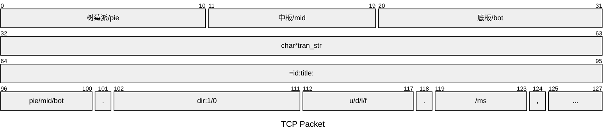

```mermaid
---
title: "TCP Packet"
---
packet-beta
0-10: "树莓派/pie"
11-19:"中板/mid"
  20-31: "底板/bot"
  32-63: "char*tran_str"
  64-95: "=id:title:"
  96-100: "pie/mid/bot"
  101: "."
  102-111:"dir:1/0"
  112-117:"u/d/l/f"
  118:"."
  119-123:"/ms"
  124:","
  125-127:"..."
```